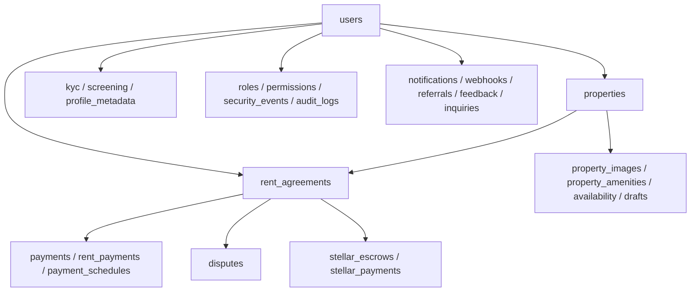

# Database Documentation Guide

## Overview

The Chioma backend uses PostgreSQL with TypeORM and the `SnakeNamingStrategy`.
Runtime entity discovery comes from `backend/src/modules/**/*.entity.ts`, while
CLI migrations are loaded from both `backend/src/migrations/` and
`backend/migrations/` through `backend/src/database/data-source.ts`.

This guide is the operational reference for schema layout, migration workflow,
index strategy, backup and recovery, retention, scaling, and troubleshooting.
Use it together with:

- `backend/src/database/data-source.ts`
- `backend/src/database/migration-runner.ts`
- `backend/scripts/backup-db.sh`
- `backend/scripts/db-restore.sh`
- `backend/docs/database/PERFORMANCE_INDEXES.md`

## Schema Overview

### Database stack

| Area               | Current implementation                                                |
| ------------------ | --------------------------------------------------------------------- |
| Engine             | PostgreSQL                                                            |
| ORM                | TypeORM 0.3.x                                                         |
| Naming             | `SnakeNamingStrategy`                                                 |
| Migrations table   | `migrations`                                                          |
| Primary IDs        | Mostly UUIDs, with selected integer IDs such as `audit_logs.id`       |
| Local/test mode    | PostgreSQL in normal runtime, in-memory SQLite in selected test flows |
| Encryption support | Field-level encryption and hashed lookup columns for sensitive values |

### Domain map



### Entity relationship summary

- `users` is the central identity table and links to KYC, profiles, payments,
  properties, notifications, API keys, referrals, MFA devices, and several
  security tables.
- `properties` belongs to owners and is expanded by images, amenities,
  availability, rental units, and inquiry activity.
- `rent_agreements` connects landlords, tenants, agents, and properties, then
  feeds disputes, reminders, Stellar escrow state, and payment records.
- `roles` and `permissions` implement the RBAC catalog through the
  `role_permissions` join table defined on the `Role` entity.
- `audit_logs`, `security_events`, and `threat_events` provide traceability and
  security monitoring for compliance and incident response.

## Migration Guide

### Commands

```bash
cd backend

pnpm run migration:show
pnpm run migration:run
pnpm run migration:run:safe
pnpm run migration:revert
pnpm run migration:revert:safe
pnpm run migration:verify-rollback
```

### Safe migration workflow

1. Review pending migrations with `pnpm run migration:show`.
2. Use `pnpm run migration:run:safe` for production-oriented execution.
3. Let `src/database/migration-runner.ts` verify the `migrations` table after
   execution.
4. If a migration fails, review the rollback outcome before retrying.

### Migration history currently present in `backend/migrations`

| Migration                                           | Purpose                                        |
| --------------------------------------------------- | ---------------------------------------------- |
| `1740020000000-CreateAnchorTables.ts`               | Initial anchor-related tables                  |
| `1740235212000-AddUserSoftDelete.ts`                | User soft-delete support                       |
| `1740300000000-AddBlockchainFieldsToAgreements.ts`  | Blockchain columns on agreements               |
| `1740310000000-AddBlockchainFieldsToEscrows.ts`     | Blockchain columns on escrows                  |
| `1740320000000-AddBlockchainFieldsToDisputes.ts`    | Blockchain columns on disputes                 |
| `1740330000000-CreateRentObligationNftsTable.ts`    | Rent obligation NFT tracking                   |
| `1740330000001-AddDisputeEnhancements.ts`           | Dispute metadata and voting extensions         |
| `1740400000000-AddSecurityHardeningTables.ts`       | Reserved legacy migration, intentionally no-op |
| `1740500000000-AddPerformanceIndexes.ts`            | Performance index rollout                      |
| `1740600000000-AddEscrowEnhancements.ts`            | Escrow lifecycle enhancements                  |
| `1769188000000-CreateAuditLogsTable.ts`             | Audit logging table                            |
| `1770500000000-AddKycStatusToUsers.ts`              | User KYC state                                 |
| `1770600000000-CreatePropertyListingDraftsTable.ts` | Listing draft workflow                         |
| `1780000000000-EncryptExistingKycDataAtRest.ts`     | KYC encryption migration                       |
| `1790000000000-AddPropertyRentalModeFields.ts`      | Rental mode metadata                           |
| `1790000000000-CreatePropertyAvailabilityTable.ts`  | Property availability calendar                 |
| `1790000000000-CreateUserAiPreferencesTable.ts`     | AI preference storage                          |

## Table Documentation

The following table groups document the currently modeled tables by domain and
their primary purpose. Column names below focus on the highest-signal fields
that operators and contributors most often need when navigating the schema.

### Identity, user profile, and onboarding

| Table                           | Purpose                                   | Key columns                                                                                                                 |
| ------------------------------- | ----------------------------------------- | --------------------------------------------------------------------------------------------------------------------------- |
| `users`                         | Canonical application user record         | `email`, `role`, `kyc_status`, `wallet_address`, `is_active`, `failed_login_attempts`, `account_locked_until`, `deleted_at` |
| `user_notification_preferences` | Per-user notification defaults            | `user_id`, timestamps                                                                                                       |
| `profile_metadata`              | Extended user profile and wallet metadata | `user_id`, `wallet_address`, `bio`, `metadata`, `data_hash`, `ipfs_cid`, `last_synced_at`                                   |
| `kyc`                           | Encrypted KYC lifecycle state             | `user_id`, encrypted data, `encryption_version`, `status`, `provider_reference`                                             |
| `mfa_devices`                   | Registered MFA factors                    | `user_id`, `device_name`, `secret_key`, `backup_codes`, `last_used_at`                                                      |
| `user_ai_preferences`           | Stored housing search preferences         | `user_id`, preferred location and feature flags                                                                             |

### Property and listing domain

| Table                       | Purpose                                | Key columns                                                                                              |
| --------------------------- | -------------------------------------- | -------------------------------------------------------------------------------------------------------- |
| `properties`                | Primary property listing table         | title/address/location, pricing, occupancy rules, owner reference, counters, verification and media URLs |
| `rental_units`              | Unit-level breakdown under a property  | `property_id`, `unit_number`, floor, bed/bath count, area, price                                         |
| `property_images`           | Listing media assets                   | `property_id`, `url`, `sort_order`, `is_primary`                                                         |
| `property_amenities`        | Amenity catalog attached to properties | `property_id`, `name`, `icon`                                                                            |
| `property_availability`     | Date-based availability calendar       | `property_id`, `date`, `available`, `blocked_by_booking_id`, `notes`                                     |
| `property_listing_drafts`   | Multi-step listing authoring state     | `landlord_id`, `current_step`, `expires_at`                                                              |
| `property_tour_engagements` | Virtual tour interaction analytics     | `property_id`, `event_type`                                                                              |
| `property_inquiries`        | User-to-owner inquiry flow             | `property_id`, `from_user_id`, `to_user_id`, sender contact fields, `viewed_at`                          |

### Agreements, payment, and tenancy lifecycle

| Table                  | Purpose                                       | Key columns                                                                                                                   |
| ---------------------- | --------------------------------------------- | ----------------------------------------------------------------------------------------------------------------------------- |
| `rent_agreements`      | Contractual link between property and parties | agreement number, `property_id`, `landlord_id`, `tenant_id`, `agent_id`, date window, blockchain fields, payment split config |
| `agreement_templates`  | Reusable agreement base documents             | `name`, `base_content`, `jurisdiction`, `is_active`                                                                           |
| `template_clauses`     | Clause library for templates                  | `title`, `content`, `display_order`, `is_mandatory`                                                                           |
| `payments`             | General payment ledger                        | `user_id`, `agreement_id`, amount/currency, `status`, payment method link, idempotency, receipt and refund fields             |
| `payment_methods`      | Saved payment instruments                     | `user_id`, `payment_type`, `last_four`, `expiry_date`, `is_default`, encrypted metadata                                       |
| `payment_schedules`    | Scheduled or recurring payment jobs           | `user_id`, `agreement_id`, `payment_method_id`, `amount`, `currency`, `interval`, retry metadata, `next_run_at`               |
| `rent_payments`        | Rent-specific payment state                   | agreement linkage, reference numbers, `amount`, `status`, `paid_at`, notes                                                    |
| `rent_reminders`       | Rent reminder workflow                        | `agreement_id`, `tenant_id`, due date, lead time, amount, send status, failure details                                        |
| `maintenance_requests` | Tenant maintenance workflow                   | property/tenant/landlord IDs, category, priority, description, media URLs                                                     |
| `sublet_requests`      | Subletting approval requests                  | agreement/party IDs, requested dates, share percentages, reason, landlord response                                            |
| `sublet_bookings`      | Approved sublet transaction records           | booking and agreement IDs, payout fields, guest and owner references                                                          |

### Disputes, reviews, and communication

| Table              | Purpose                                 | Key columns                                                                              |
| ------------------ | --------------------------------------- | ---------------------------------------------------------------------------------------- |
| `disputes`         | Core dispute record                     | `agreement_id`, initiator, resolution, blockchain linkage, vote totals, transaction hash |
| `dispute_comments` | Internal or external dispute discussion | `dispute_id`, `user_id`, `content`, `is_internal`                                        |
| `dispute_events`   | Event timeline entries for disputes     | `dispute_id`, `event_data`, `timestamp`                                                  |
| `dispute_evidence` | Uploaded evidence metadata              | `dispute_id`, uploader, file details, description                                        |
| `dispute_votes`    | Arbiter vote records                    | `dispute_id`, `arbiter_id`, vote direction, evidence, reasoning, vote weight             |
| `arbiters`         | Arbiter roster and stats                | `user_id`, active flag, blockchain timestamps, resolution metrics                        |
| `reviews`          | Shared review model                     | reviewer/reviewee IDs, rating, context, property linkage, reported flag                  |
| `guest_reviews`    | Guest review details                    | booking and party IDs, guest-specific review scores                                      |
| `host_reviews`     | Host review details                     | booking and party IDs, host-specific review scores                                       |
| `chat_room`        | Messaging room/group metadata           | room identifier and participant relationships                                            |
| `message`          | Direct or room messages                 | sender and receiver IDs, content, timestamp                                              |
| `participant`      | Messaging participant links             | user reference and chat-room relationship                                                |

### Security, compliance, and developer operations

| Table                      | Purpose                                         | Key columns                                                                          |
| -------------------------- | ----------------------------------------------- | ------------------------------------------------------------------------------------ |
| `roles`                    | RBAC role catalog                               | `name`, `description`, `system_role`, `is_active`                                    |
| `permissions`              | RBAC permission catalog                         | `name`, `resource`, `action`, `description`, `is_active`                             |
| `role_permissions`         | Many-to-many join between roles and permissions | `role_id`, `permission_id`                                                           |
| `security_events`          | Security telemetry events                       | `user_id`, event type, severity, IP, user agent, JSON `details`, success/error state |
| `threat_events`            | Threat detection findings                       | user and request metadata, threat type/level/status, evidence, mitigation fields     |
| `audit_logs`               | Immutable operational and security audit trail  | action, entity linkage, actor, status, IP, metadata, timestamps                      |
| `api_keys`                 | Developer API keys                              | owner, hashed key material, rotation fields, expiration and usage tracking           |
| `api_key_rotation_history` | Historical API key rotation trail               | old/new prefixes and hashes, rotation timestamp                                      |
| `auth_metrics`             | Authentication analytics                        | success flag and supporting metrics                                                  |
| `feedback`                 | Product feedback intake                         | email, message, type, optional user reference                                        |

### Screening, notification, webhook, and ecosystem integrations

| Table                       | Purpose                               | Key columns                                                       |
| --------------------------- | ------------------------------------- | ----------------------------------------------------------------- |
| `tenant_screening_requests` | Screening request payload envelope    | tenant/requester IDs, consent fields, encrypted applicant payload |
| `tenant_screening_consents` | Screening consent capture             | screening and tenant IDs, consent version, grant time             |
| `tenant_screening_reports`  | Stored screening results              | screening linkage, encrypted report                               |
| `notifications`             | In-app notification delivery          | `user_id`, title, message, type, read status                      |
| `webhook_endpoints`         | Registered outbound webhook targets   | `url`, subscribed events, active flag                             |
| `webhook_deliveries`        | Outbound webhook delivery attempts    | endpoint, event, payload, success flag, attempt count             |
| `referrals`                 | Referral attribution                  | referrer, referred user, conversion timestamp                     |
| `file_metadata`             | Stored file metadata                  | file naming, size/type, S3 key, owner                             |
| `supported_currencies`      | Supported fiat/token currency catalog | code, name, activation flag, anchor URL, Stellar asset metadata   |

### Blockchain and ledger support

| Table                  | Purpose                                  | Key columns                                                                                       |
| ---------------------- | ---------------------------------------- | ------------------------------------------------------------------------------------------------- |
| `stellar_accounts`     | Managed Stellar accounts                 | `user_id`, `public_key`, encrypted secret, balance, sequence, active flag                         |
| `stellar_escrows`      | Escrow state mirrored from Stellar flows | account IDs, asset info, amount, release conditions, expiration, dispute linkage, multisig fields |
| `stellar_payments`     | Stellar payment mirror                   | agreement ID, amount, participant addresses, payment date, status                                 |
| `stellar_transactions` | Generic Stellar transaction index        | transaction hash, ledger, asset and account fields, fee, memo, status, errors                     |
| `anchor_transactions`  | Anchor transaction tracking              | anchor transaction ID, amount, currency, wallet address                                           |
| `indexed_transactions` | Indexed ledger events for app linkage    | ledger metadata, source account, amounts, asset info, agreement/property/payment references       |
| `agent_transactions`   | Agent transaction tracking               | agent address, parties, completion state                                                          |
| `property_registry`    | On-chain property registry mirror        | owner address, metadata hash, verification fields                                                 |
| `property_history`     | Property transfer history mirror         | property reference, source/destination addresses, transaction hash, transfer time                 |
| `escrow_conditions`    | Escrow release conditions                | escrow ID, parameters, satisfaction flags, validation results                                     |
| `escrow_signatures`    | Escrow signature approvals               | escrow ID, signer address, signature, validation metadata                                         |
| `rent_obligation_nfts` | NFT-backed rent obligation tracking      | agreement linkage, owner, mint hash, transfer count, status                                       |
| `nft_transfers`        | NFT transfer ledger                      | token ID, source/destination addresses, transaction hash, transfer time                           |

## Indexes and Performance Optimization

The primary index rollout is documented in
`backend/docs/database/PERFORMANCE_INDEXES.md`. Existing optimization focuses
on user, property, agreement, dispute, payment, and notification retrieval.

## Backup and Recovery

### Backup procedure

```bash
cd backend
pnpm run db:backup
```

`backend/scripts/backup-db.sh` reads `DB_*` env vars, supports Docker mode,
writes backups to `BACKUP_DIR`, gzips dumps, and prunes files older than
`RETENTION_DAYS`.

### Recovery procedure

```bash
cd backend
pnpm run db:restore -- /path/to/backup.sql.gz
```

`backend/scripts/db-restore.sh` supports explicit or latest-file restores,
Docker and non-Docker flows, and both plain SQL and gzipped dumps.

## Data Retention Policies

| Data class                                        | Suggested retention                                                    |
| ------------------------------------------------- | ---------------------------------------------------------------------- |
| `audit_logs`, `security_events`, `threat_events`  | Keep at least 12 months online; archive before deletion                |
| `webhook_deliveries` and other delivery telemetry | 30 to 90 days depending on debugging needs                             |
| `notifications`                                   | Keep recent records online; archive or prune read records periodically |
| KYC and screening data                            | Retain according to regulatory and contractual obligations only        |
| Backup files                                      | Minimum 30 days, longer for production or compliance environments      |

## Scaling and Troubleshooting

- scale PostgreSQL vertically first for monolith-friendly growth
- move read-heavy analytics to replicas as production read pressure grows
- run `EXPLAIN ANALYZE` for slow queries and compare with documented indexes
- verify `DB_*` vars and `BACKUP_DIR` permissions when backup or restore fails
- verify active encryption keys and hashed lookup columns when encrypted field lookups fail

## Scheduled Maintenance

`DatabaseMaintenanceService` runs from the backend cleanup module every day at
03:00. For PostgreSQL deployments it:

- Reads `pg_stat_user_tables` to identify tables with accumulated dead tuples.
- Runs `VACUUM (ANALYZE)` so PostgreSQL can reclaim space and refresh planner
  statistics.
- Skips maintenance automatically for non-PostgreSQL test databases.

Run the service during low-traffic windows. If dead tuple counts remain high
after repeated runs, review long-running transactions, autovacuum settings, and
table-specific write patterns before increasing maintenance frequency.
