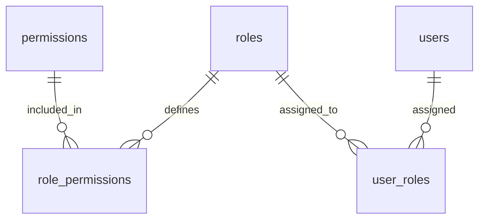
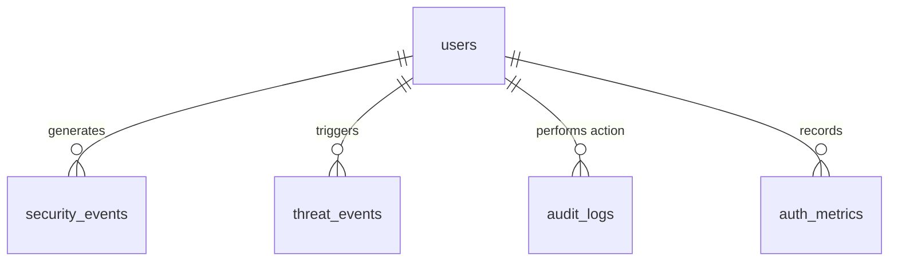
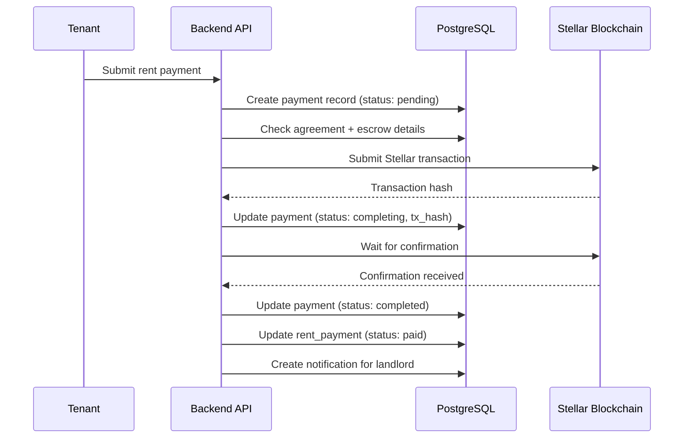
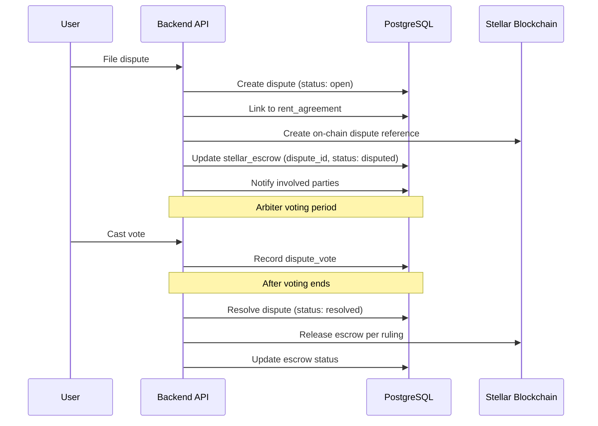

# Database Schema and Relationships

## Overview

This document provides a detailed description of the Chioma database schema, entity relationships, data flow patterns, and key design decisions. It serves as the definitive reference for understanding how data is structured and connected across the platform.

Use this document alongside:

- [Database Documentation Guide](./DATABASE_DOCUMENTATION_GUIDE.md)
- [Performance Indexes](./PERFORMANCE_INDEXES.md)
- [Data Source Configuration](../src/database/data-source.ts)

---

## Entity Relationship Diagram

### Core Domain Relationships

```mermaid
erDiagram
    users ||--o| landlord_profiles : has
    users ||--o| tenant_profiles : has
    users ||--o| agent_profiles : has
    users ||--o| kyc : has
    users ||--o| mfa_devices : has
    users ||--o| api_keys : has
    users ||--o| notifications : receives
    users ||--o| reviews : writes
    users ||--o| user_ai_preferences : has
    users ||--o| profile_metadata : has

    users ||--o{ properties : owns
    users ||--o{ rent_agreements : "as landlord"
    users ||--o{ rent_agreements : "as tenant"
    users ||--o{ rent_agreements : "as agent"
    users ||--o{ disputes : initiates
    users ||--o{ stellar_accounts : manages
    users ||--o{ referrals : refers
    users ||--o| referrals : "was referred"

    properties ||--o{ property_images : contains
    properties ||--o{ property_amenities : has
    properties ||--o{ property_availability : schedules
    properties ||--o{ rental_units : contains
    properties ||--o{ property_inquiries : receives
    properties ||--o{ property_listing_drafts : drafts
    properties ||--o{ property_tour_engagements : tracks
    properties ||--o{ reviews : receives

    rent_agreements ||--o{ rent_payments : generates
    rent_agreements ||--o{ payment_schedules : schedules
    rent_agreements ||--o{ disputes : may_have
    rent_agreements ||--o{ stellar_escrows : uses
    rent_agreements ||--o{ rent_reminders : triggers
    rent_agreements ||--o{ maintenance_requests : includes
    rent_agreements ||--o{ sublet_requests : authorizes
    rent_agreements ||--o| agreement_templates : uses

    rent_payments ||--o| payments : "links to"
    payments ||--o| payment_methods : uses
    payment_schedules ||--o| payment_methods : uses

    disputes ||--o{ dispute_comments : has
    disputes ||--o{ dispute_evidence : contains
    disputes ||--o{ dispute_events : logs
    disputes ||--o{ dispute_votes : collects
    disputes ||--o{ arbiters : assigned_to

    stellar_escrows ||--o{ escrow_conditions : defines
    stellar_escrows ||--o{ escrow_signatures : requires
    stellar_accounts ||--o{ stellar_payments : sends
    stellar_accounts ||--o{ stellar_transactions : signs

    notifications ||--o{ webhook_endpoints : triggers
    webhook_endpoints ||--o{ webhook_deliveries : records
```

### Access Control Relationships

### Security and Audit Relationships

---

## Core Entity Relationships

### users

`users` is the central identity table. Every other domain entity links back to it.

| Column                  | Type                                             | Description                                                  |
| ----------------------- | ------------------------------------------------ | ------------------------------------------------------------ |
| `id`                    | UUID                                             | Primary key                                                  |
| `email`                 | VARCHAR(255)                                     | Unique email address (used for password auth)                |
| `password_hash`         | VARCHAR(255)                                     | bcrypt hash of the password (nullable for wallet-only users) |
| `role`                  | ENUM('user','tenant','landlord','agent','admin') | Application-level role                                       |
| `kyc_status`            | ENUM('none','pending','verified','rejected')     | KYC verification state                                       |
| `wallet_address`        | VARCHAR(56)                                      | Stellar wallet public key                                    |
| `is_active`             | BOOLEAN                                          | Whether the account is active                                |
| `failed_login_attempts` | INTEGER                                          | Counter for failed password attempts                         |
| `account_locked_until`  | TIMESTAMP                                        | Lockout expiration (null if not locked)                      |
| `language`              | VARCHAR(10)                                      | User's preferred language                                    |
| `timezone`              | VARCHAR(50)                                      | User's timezone                                              |
| `two_factor_enabled`    | BOOLEAN                                          | Whether MFA is enabled                                       |
| `email_verified`        | BOOLEAN                                          | Whether email has been verified                              |
| `deleted_at`            | TIMESTAMP                                        | Soft delete timestamp (null if active)                       |
| `created_at`            | TIMESTAMP                                        | Record creation timestamp                                    |
| `updated_at`            | TIMESTAMP                                        | Record last update timestamp                                 |

**Relationships:**

- Has one `landlord_profiles`, `tenant_profiles`, or `agent_profiles` depending on role
- Has many `properties` (as owner)
- Has many `rent_agreements` (as landlord, tenant, or agent)
- Has many `notifications`, `reviews`, `disputes`, `stellar_accounts`
- Has one `kyc`, `profile_metadata`, `user_ai_preferences`
- Has many `mfa_devices`, `api_keys`
- Has many `user_roles` (linking to `roles` for RBAC)

### properties

Central listing entity representing a rental property.

| Column             | Type          | Description                           |
| ------------------ | ------------- | ------------------------------------- |
| `id`               | UUID          | Primary key                           |
| `landlord_id`      | UUID          | Foreign key to users                  |
| `title`            | VARCHAR(255)  | Property listing title                |
| `description`      | TEXT          | Detailed property description         |
| `property_type`    | ENUM          | apartment, house, condo, studio, etc. |
| `status`           | ENUM          | draft, published, rented, unavailable |
| `price`            | DECIMAL(12,2) | Monthly rent price                    |
| `security_deposit` | DECIMAL(12,2) | Required security deposit             |
| `currency`         | VARCHAR(10)   | Currency code (e.g., USD, NGN)        |
| `city`             | VARCHAR(100)  | Property city                         |
| `state`            | VARCHAR(100)  | Property state/province               |
| `country`          | VARCHAR(100)  | Property country                      |
| `address`          | TEXT          | Full street address                   |
| `latitude`         | DECIMAL(10,7) | Geocoordinate latitude                |
| `longitude`        | DECIMAL(10,7) | Geocoordinate longitude               |
| `bedrooms`         | INTEGER       | Number of bedrooms                    |
| `bathrooms`        | DECIMAL(3,1)  | Number of bathrooms                   |
| `square_feet`      | INTEGER       | Total square footage                  |
| `available_from`   | DATE          | Earliest move-in date                 |
| `stellar_key`      | VARCHAR(56)   | Stellar public key for rent payments  |
| `view_count`       | INTEGER       | Listing view counter                  |
| `inquiry_count`    | INTEGER       | Inquiry counter                       |
| `created_at`       | TIMESTAMP     | Record creation timestamp             |
| `updated_at`       | TIMESTAMP     | Record last update timestamp          |

**Relationships:**

- Belongs to `users` (as landlord)
- Has many `property_images`, `property_amenities`, `rental_units`
- Has many `rent_agreements`
- Has many `property_inquiries`, `reviews`
- Has one `property_availability` (calendar)

### rent_agreements

Core contractual entity linking landlords, tenants, agents, and properties.

| Column                    | Type          | Description                            |
| ------------------------- | ------------- | -------------------------------------- |
| `id`                      | UUID          | Primary key                            |
| `agreement_number`        | VARCHAR(50)   | Human-readable agreement identifier    |
| `property_id`             | UUID          | Foreign key to properties              |
| `landlord_id`             | UUID          | Foreign key to users (landlord)        |
| `tenant_id`               | UUID          | Foreign key to users (tenant)          |
| `agent_id`                | UUID          | Foreign key to users (agent, nullable) |
| `start_date`              | DATE          | Lease start date                       |
| `end_date`                | DATE          | Lease end date                         |
| `monthly_rent`            | DECIMAL(12,2) | Monthly rent amount                    |
| `security_deposit`        | DECIMAL(12,2) | Security deposit amount                |
| `currency`                | VARCHAR(10)   | Currency code                          |
| `payment_due_day`         | INTEGER       | Day of month rent is due (1-31)        |
| `status`                  | ENUM          | draft, active, terminated, expired     |
| `on_chain_status`         | ENUM          | pending, synced, failed                |
| `blockchain_agreement_id` | VARCHAR(255)  | On-chain agreement identifier          |
| `escrow_address`          | VARCHAR(56)   | Stellar escrow account address         |
| `landlord_split_percent`  | DECIMAL(5,2)  | Landlord's percentage of payment       |
| `agent_split_percent`     | DECIMAL(5,2)  | Agent's commission percentage          |
| `late_fee`                | DECIMAL(12,2) | Late payment fee amount                |
| `grace_period_days`       | INTEGER       | Days before late fee applies           |
| `terms`                   | TEXT          | Full agreement terms text              |
| `signed_by_landlord_at`   | TIMESTAMP     | Landlord signature timestamp           |
| `signed_by_tenant_at`     | TIMESTAMP     | Tenant signature timestamp             |
| `created_at`              | TIMESTAMP     | Record creation timestamp              |
| `updated_at`              | TIMESTAMP     | Record last update timestamp           |

**Relationships:**

- Belongs to `properties`
- Belongs to `users` (as landlord, tenant, agent)
- Has many `rent_payments`, `payment_schedules`
- Has many `disputes`
- Has many `stellar_escrows`
- Has many `rent_reminders`, `maintenance_requests`, `sublet_requests`

### payments / rent_payments

Payment tracking entities.

**payments** is the general payment ledger:

| Column              | Type          | Description                          |
| ------------------- | ------------- | ------------------------------------ |
| `id`                | UUID          | Primary key                          |
| `user_id`           | UUID          | Foreign key to users (payer)         |
| `agreement_id`      | UUID          | Foreign key to rent_agreements       |
| `amount`            | DECIMAL(12,2) | Payment amount                       |
| `currency`          | VARCHAR(10)   | Currency code                        |
| `status`            | ENUM          | pending, completed, failed, refunded |
| `payment_type`      | ENUM          | rent, deposit, fee, commission       |
| `payment_method_id` | UUID          | Foreign key to payment_methods       |
| `idempotency_key`   | VARCHAR(255)  | Unique key for idempotent processing |
| `stellar_tx_hash`   | VARCHAR(64)   | Stellar transaction hash             |
| `receipt_url`       | TEXT          | URL to payment receipt               |
| `refund_id`         | UUID          | Reference to refund payment          |
| `notes`             | TEXT          | Internal notes                       |
| `paid_at`           | TIMESTAMP     | Payment completion timestamp         |
| `created_at`        | TIMESTAMP     | Record creation timestamp            |
| `updated_at`        | TIMESTAMP     | Record last update timestamp         |

**rent_payments** extends payment tracking with rent-specific fields:

| Column         | Type          | Description                    |
| -------------- | ------------- | ------------------------------ |
| `id`           | UUID          | Primary key                    |
| `agreement_id` | UUID          | Foreign key to rent_agreements |
| `amount`       | DECIMAL(12,2) | Rent amount                    |
| `period_start` | DATE          | Start of payment period        |
| `period_end`   | DATE          | End of payment period          |
| `status`       | ENUM          | pending, paid, overdue, failed |
| `paid_at`      | TIMESTAMP     | Payment timestamp              |
| `notes`        | TEXT          | Payment notes                  |

**Relationships:**

- `payments` belongs to `users` and `rent_agreements`
- `payments` optionally links to `payment_methods`
- `rent_payments` belongs to `rent_agreements`

### disputes

Dispute resolution tracking for rental agreements.

| Column                    | Type          | Description                                                         |
| ------------------------- | ------------- | ------------------------------------------------------------------- |
| `id`                      | UUID          | Primary key                                                         |
| `agreement_id`            | UUID          | Foreign key to rent_agreements                                      |
| `initiated_by`            | UUID          | Foreign key to users (who filed the dispute)                        |
| `resolved_by`             | UUID          | Foreign key to users (arbiter who resolved)                         |
| `dispute_type`            | ENUM          | rent_payment, security_deposit, property_damage, lease_terms, other |
| `status`                  | ENUM          | open, under_review, resolved, rejected, escalated                   |
| `description`             | TEXT          | Detailed dispute description                                        |
| `resolution`              | TEXT          | Resolution outcome description                                      |
| `amount_in_dispute`       | DECIMAL(12,2) | Monetary amount in dispute                                          |
| `ruling`                  | ENUM          | in_favor_of_landlord, in_favor_of_tenant, split, dismissed          |
| `blockchain_agreement_id` | VARCHAR(255)  | On-chain dispute identifier                                         |
| `transaction_hash`        | VARCHAR(64)   | Blockchain transaction hash                                         |
| `voting_end_date`         | TIMESTAMP     | Deadline for arbiter voting                                         |
| `landlord_vote_count`     | INTEGER       | Votes in favor of landlord                                          |
| `tenant_vote_count`       | INTEGER       | Votes in favor of tenant                                            |
| `created_at`              | TIMESTAMP     | Record creation timestamp                                           |
| `updated_at`              | TIMESTAMP     | Record last update timestamp                                        |

**Relationships:**

- Belongs to `rent_agreements`
- Belongs to `users` (as initiator, resolver)
- Has many `dispute_comments`, `dispute_evidence`, `dispute_events`, `dispute_votes`
- May be assigned to `arbiters`

### stellar_escrows

Blockchain escrow accounts linked to rental agreements.

| Column                 | Type          | Description                                            |
| ---------------------- | ------------- | ------------------------------------------------------ |
| `id`                   | UUID          | Primary key                                            |
| `rent_agreement_id`    | UUID          | Foreign key to rent_agreements                         |
| `dispute_id`           | UUID          | Foreign key to disputes (nullable)                     |
| `blockchain_escrow_id` | VARCHAR(255)  | On-chain escrow identifier                             |
| `escrow_address`       | VARCHAR(56)   | Stellar escrow account address                         |
| `asset_code`           | VARCHAR(12)   | Stellar asset code                                     |
| `asset_issuer`         | VARCHAR(56)   | Stellar asset issuer (null for XLM)                    |
| `amount`               | DECIMAL(20,7) | Amount held in escrow                                  |
| `release_conditions`   | JSONB         | Conditions for escrow release                          |
| `status`               | ENUM          | funded, locked, releasing, released, disputed, expired |
| `expiration_date`      | TIMESTAMP     | Escrow expiration                                      |
| `multisig_enabled`     | BOOLEAN       | Whether multisig is active                             |
| `created_at`           | TIMESTAMP     | Record creation timestamp                              |
| `updated_at`           | TIMESTAMP     | Record last update timestamp                           |

**Relationships:**

- Belongs to `rent_agreements`
- Optionally belongs to `disputes`
- Has many `escrow_conditions`, `escrow_signatures`

---

## Join and Association Tables

### role_permissions

Maps roles to their granted permissions (many-to-many).

| Column          | Type | Description                               |
| --------------- | ---- | ----------------------------------------- |
| `role_id`       | UUID | Foreign key to roles (composite PK)       |
| `permission_id` | UUID | Foreign key to permissions (composite PK) |

### user_roles

Maps users to their assigned roles (many-to-many).

| Column    | Type | Description                         |
| --------- | ---- | ----------------------------------- |
| `user_id` | UUID | Foreign key to users (composite PK) |
| `role_id` | UUID | Foreign key to roles (composite PK) |

---

## Key Relationship Patterns

### 1. Polymorphic Ownership

Some entities use a polymorphic pattern where a field can reference different entity types. For example:

- `reviews` can reference a `property` or a `user` as the subject
- `notifications` can reference various entity types through context fields

### 2. Soft Delete

The `users` table uses soft deletes via a `deleted_at` timestamp. All queries against `users` should filter `WHERE deleted_at IS NULL` unless explicitly including deleted records. Other tables may adopt this pattern as needed.

### 3. Encrypted Fields

Sensitive data in `kyc`, `payment_methods`, and certain user profile fields is encrypted at rest using AES-256-GCM. Where exact-match lookup is needed, an HMAC-SHA256 hashed column provides a searchable reference without exposing the plaintext value.

### 4. Stellar Blockchain Mirror

Several tables (`stellar_accounts`, `stellar_escrows`, `stellar_payments`, `stellar_transactions`) mirror on-chain state for efficient querying. These records are updated through blockchain event listening and may lag slightly behind the actual chain state.

---

## Data Flow Patterns

### Rent Payment Flow

### Dispute Flow

---

## Design Decisions

### UUID Primary Keys

All primary keys use UUIDs (v4) rather than auto-incrementing integers. This:

- Prevents information leakage through sequential IDs
- Enables safe distributed ID generation
- Avoids conflicts in distributed or offline-first scenarios

Exception: `audit_logs.id` uses `BIGSERIAL` for write performance at high volume.

### Snake Case Naming

TypeORM uses `SnakeNamingStrategy` which automatically converts entity property names from camelCase to snake_case in the database. All table and column names in SQL migrations should use snake_case for consistency.

### Soft vs Hard Deletes

- Soft delete (`deleted_at`) is used for `users` to preserve referential integrity.
- Hard delete is used for transient or high-volume data (e.g., `webhook_deliveries` after retention period).
- Cascade delete is used sparingly and only where data has no independent value.

### Composite Keys

Join tables (`role_permissions`, `user_roles`) use composite primary keys. All other tables use UUID single-column primary keys.

---

## Migration Management

See [DATABASE_DOCUMENTATION_GUIDE.md](./DATABASE_DOCUMENTATION_GUIDE.md) for the complete migration workflow and history.

### Key Migration Rules

1. Every migration must be reversible (have an `up` and `down` method).
2. Test rollback before deploying to production.
3. Never modify a committed migration — create a new one.
4. Review migration order — migrations run sequentially by timestamp prefix.
5. Avoid long-running locks on large tables — use `CONCURRENTLY` for index creation.

---

## Related Documentation

- [Database Documentation Guide](./DATABASE_DOCUMENTATION_GUIDE.md)
- [Performance Indexes](./PERFORMANCE_INDEXES.md)
- [Data Source Configuration](../src/database/data-source.ts)
- [SQL Migration Files](../src/database/migrations/)
- [Entity Files](../src/modules/)
